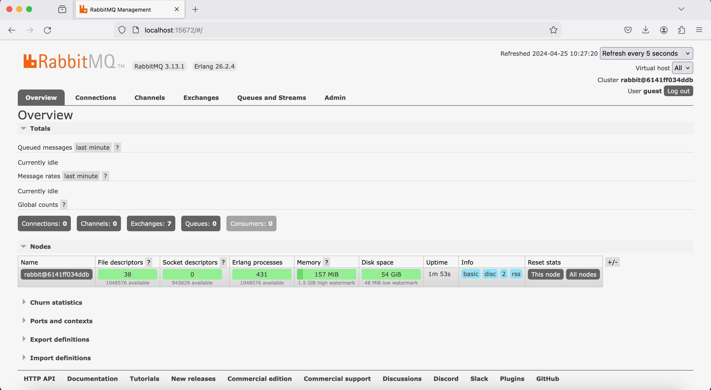

# tutorial-8-publisher

## Reflection 1a
Since there are 5 `publish_event` method calls within the `main` function inside src/main.rs, there would be 5 messages that is sent from the publisher.

## Reflection 1b
It means that both the subscriber and the publisher interact with the message broker at the same host and port using the same credentials (username and password) and protocol (amqp).

## Images

The image above shows the RabbitMQ dashboard, specifically the Overview tab. The Overview tab displays the amount of queued messages from the last minute, message rates per second, global counts, RabbitMQ nodes, and more.

The image above shows the RabbitMQ dashboard after receiving a connection from the publisher app.

The image above shows the RabbitMQ dashboard, the publisher app's console and the subscriber app's console. After we invoke `cargo run` on the publisher console, the publisher's app sends 5 messages to RabbitMQ. RabbitMQ then forwards the messages to the subscriber's app, notifying the subscriber to log the messages to the console.

When we run the publisher app, the message rates metric will go up by the amount of messages sent from the publisher. Invoking `cargo run` multiple times within a short interval means launching the publisher app multiple times, sending 5 messages each time. The last `cargo run` invocation in the image is run immediately after the second-to-last invocation, causing the message rates to spike up to 2 messages per second.
